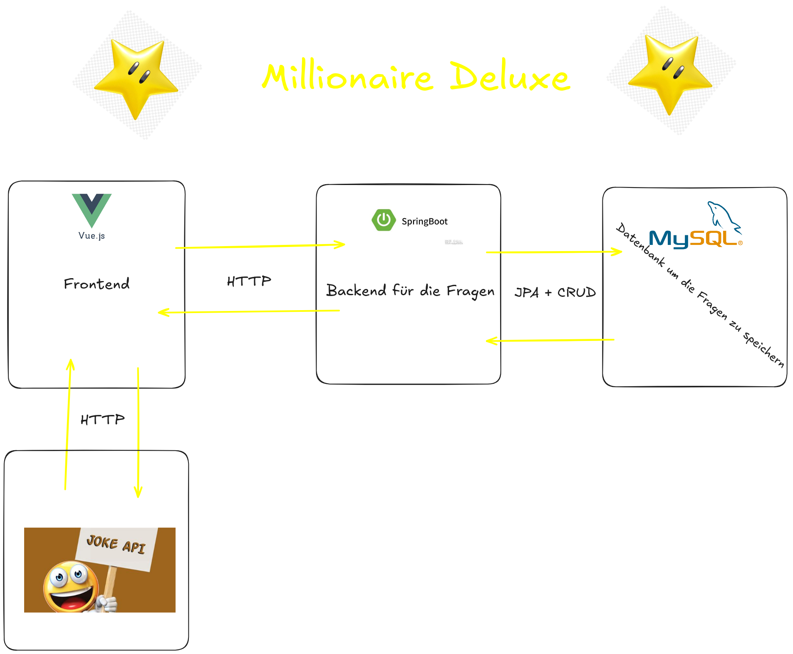

# Dokumentation

## projektbeschreibung

Das Ziel des "Millionaire Deluxe"-Projekts ist es, ein interaktives und unterhaltsames Quizspiel zu entwickeln, das den Spielern die Möglichkeit bietet, ihr Wissen in verschiedenen Kategorien zu testen und dabei die Chance zu haben, virtuelle Preise oder Belohnungen zu gewinnen.

Die Hauptziele des Projekts sind:

- Unterhaltung: Bereitstellung eines spannenden und fesselnden Spielerlebnisses, das die Nutzer dazu anregt, ihr Wissen zu erweitern und Spaß zu haben.
- Vielfältige Kategorien: Entwicklung von Fragen aus verschiedenen Themenbereichen (z. B. Geschichte, Wissenschaft, Popkultur, Sport), um ein breites Publikum anzusprechen.
- Benutzerfreundlichkeit: Gestaltung einer intuitiven Benutzeroberfläche, die es den Spielern ermöglicht, einfach zu navigieren und das Spiel zu genießen.

Hier kann man die Architektur sehen auf der das Projekt aufgebaut wurde.

## projektplanung

## datenbank modell
